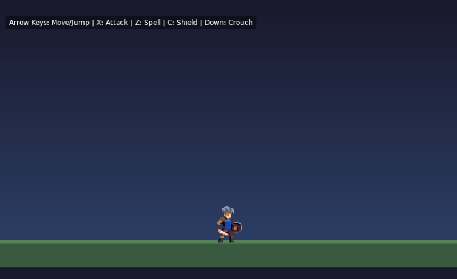

# 🧙 WizAI Game Agent

A 2D pixel-art platformer built with **Phaser 3 + TypeScript + Vite**, developed using AI-assisted game programming.



## 🎮 Play

### Controls

| Key | Action |
|-----|--------|
| ← → | Move left/right |
| ↑ | Jump |
| X | Attack |
| Z | Spell cast |
| C | Shield (hold) |
| ↓ | Crouch |

## 🛠️ Tech Stack

- **Phaser 3** — 2D game engine
- **TypeScript** — Type-safe game logic
- **Vite** — Fast build tool & dev server

## 🚀 Getting Started

```bash
# Install dependencies
npm install

# Start dev server
npm run dev

# Build for production
npm run build
```

Dev server runs at `http://localhost:3000/`

## 📁 Project Structure

```
game/
├── src/
│   ├── main.ts              # Game config & entry
│   └── scenes/
│       ├── BootScene.ts     # Asset loading & animation setup
│       └── GameScene.ts     # Main gameplay, controls, state machine
├── public/
│   └── assets/
│       ├── characters/      # Sprite sheets (blue/green/purple/red)
│       └── assets.json      # Sprite sheet manifest
├── index.html
├── vite.config.ts
├── tsconfig.json
└── package.json
```

## 🎨 Character Animations

The game features a versatile character sprite set with **22 animations**:

**Sheet 1** — Idle, Attack, Combo, Run, Jump (5 phases), Damage, Death, Spell, Crouch, Shield

**Sheet 2** — Walk, Slide (3 phases), Wall Slide, Critical Attack, Ladder Climb

4 color variants available: Blue, Green, Purple, Red (56×56px frames)

## 🎯 Features

- ✅ Character state machine with smooth animation transitions
- ✅ Arcade physics (gravity, ground collision, jumping)
- ✅ Full sprite sheet animation system
- ✅ Keyboard input with multiple action types
- ✅ Pixel-perfect rendering
- 🔜 Parallax background & tilemap terrain
- 🔜 Enemy AI with combat system
- 🔜 Level design with platforms & ladders
- 🔜 Audio & visual effects

## 📝 Credits

- Character sprites: **Generic Character v0.2** by [brullov](https://twitter.com/brullov_art)
- Game engine: [Phaser 3](https://phaser.io/)

## 📄 License

MIT
